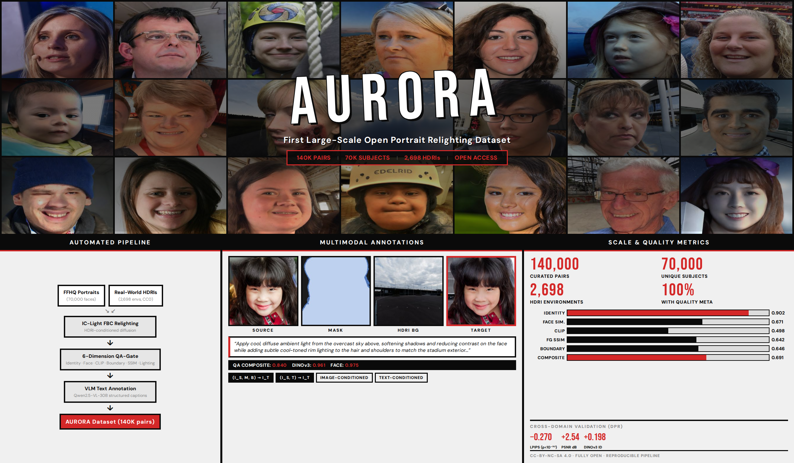
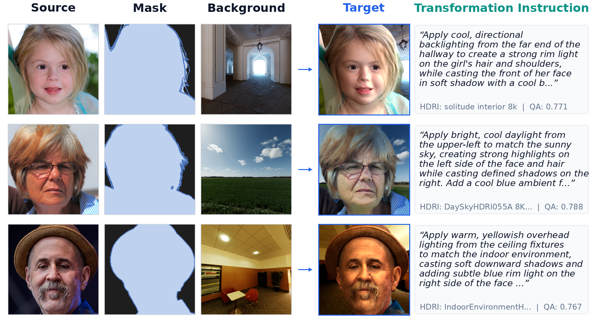
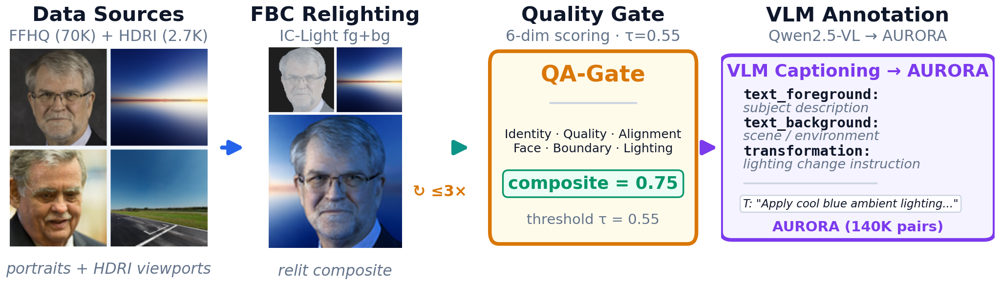
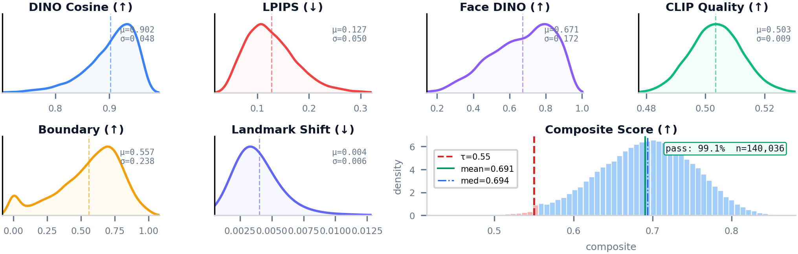
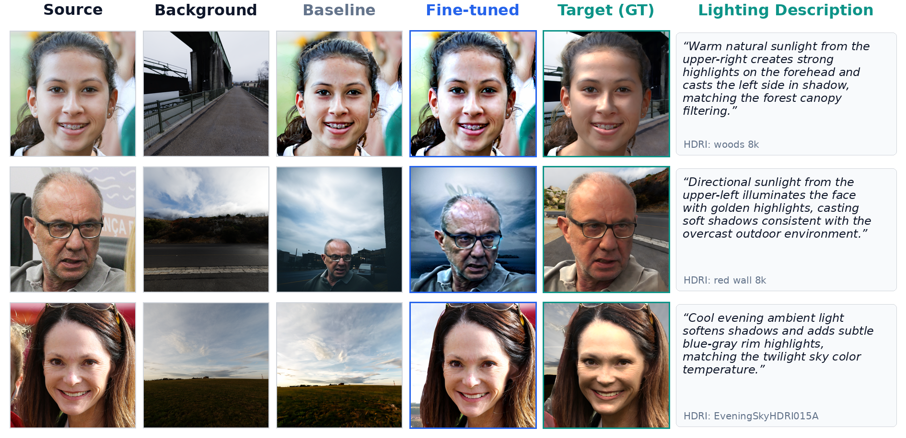

# LITORA: A Large-Scale Open Portrait Relighting Dataset

**L**ighting-grounded **I**mage/**T**ext **O**pen **R**elighting **A**ssets

[](https://creativecommons.org/licenses/by-nc-sa/4.0/)

> **LITORA** is the first large-scale, openly-available portrait relighting dataset with **140K pairs** spanning **70K subjects** and **2,698 HDRI environments**, multimodal annotations, and per-sample quality metadata.



---

## Overview

LITORA is constructed through a fully automated synthesis pipeline (**AnyLight**) that cross-mixes 70K [FFHQ](https://github.com/NVlabs/ffhq-dataset) portraits with 2,698 CC0-licensed HDRI environment maps from [Poly Haven](https://polyhaven.com) and [ambientCG](https://ambientcg.com).

| Property | Value |
|---|---|
| Subjects | 70,000 (FFHQ) |
| HDRI Environments | 2,698 (CC0) |
| Total Pairs | 140,036 |
| Resolution | 1024 x 1024 |
| Train / Test Split | 126K / 14K (subject-disjoint) |
| License | CC-BY-NC-SA 4.0 |

## Dataset Components

Each sample contains:

| Component | Description |
|---|---|
| `source.png` | Source portrait (I_s) |
| `mask.png` | Foreground mask (M) |
| `background.png` | HDRI-derived background viewport (B) |
| `target.png` | Diffusion-relit target (I_t) |
| `metadata.json` | VLM transformation instruction (T), quality scores (Q), generation provenance |



## Pipeline



The AnyLight pipeline operates in four stages:

1. **HDRI Processing** -- Extracts SH lighting, dominant light detection, and LDR background viewports via perspective sampling with ACES tone mapping.
2. **HDRI-Conditioned Relighting** -- IC-Light (SD v1.5) foreground-background compositing generates relit targets at scale.
3. **Quality Gating (QA-Gate)** -- Six-dimensional scoring (identity, quality, alignment, face, boundary, lighting) with composite threshold and retry mechanism.
4. **VLM Annotation** -- Qwen2.5-VL generates per-sample transformation instructions for text-conditioned training.

## Quality Distributions



Per-sample quality scores are released with every sample, enabling downstream users to filter by desired quality thresholds. Default gate: tau = 0.55 (98.6% first-attempt pass rate).

## Downstream Results

Fine-tuning OmniGen-v1 on LITORA yields cross-domain improvements on independent DPR ratio-image targets:

| Metric | Baseline | Fine-tuned | Delta |
|---|---|---|---|
| LPIPS (lower is better) | 0.706 | **0.436** | **-0.270** |
| PSNR (higher is better) | 8.81 | **11.35** | **+2.54 dB** |
| SSIM (higher is better) | 0.255 | **0.379** | **+0.124** |
| DINOv3 Identity | 0.590 | **0.788** | **+0.198** |



## Download

**Full release coming soon.** The dataset, pipeline code, QA-Gate framework, and random seeds for exact reproduction will be made available here.

## Training Paradigms

LITORA supports two downstream conditioning modes:

- **Image-conditioned**: (I_s, M, B) -> I_t
- **Text-conditioned**: (I_s, T) -> I_t

## Citation

```bibtex
@inproceedings{litora2026,
  title     = {{LITORA}: A Large-Scale Open Portrait Relighting Dataset
               with {AnyLight} HDRI-Grounded Synthesis and Multimodal Annotations},
  author    = {Un, Kinseong and Li, Yanfeng and Gao, Qinquan and Deng, Wei
               and Tang, Su-Kit and Chan, Ka-Hou and Tan, Tao and Sun, Yue},
  booktitle = {ACM Multimedia},
  year      = {2026},
}
```

## License

- **Dataset**: CC-BY-NC-SA 4.0 (inherited from FFHQ)
- **HDRI assets**: CC0 (Poly Haven, ambientCG) -- source attribution preserved
- **Code**: MIT

## Acknowledgments

- [FFHQ](https://github.com/NVlabs/ffhq-dataset) (Karras et al., CVPR 2019)
- [IC-Light](https://github.com/lllyasviel/IC-Light) (Zhang et al., ICLR 2025)
- [Poly Haven](https://polyhaven.com) and [ambientCG](https://ambientcg.com) for CC0 HDRIs
- [OmniGen](https://github.com/VectorSpaceLab/OmniGen) (Xiao et al., 2024)
